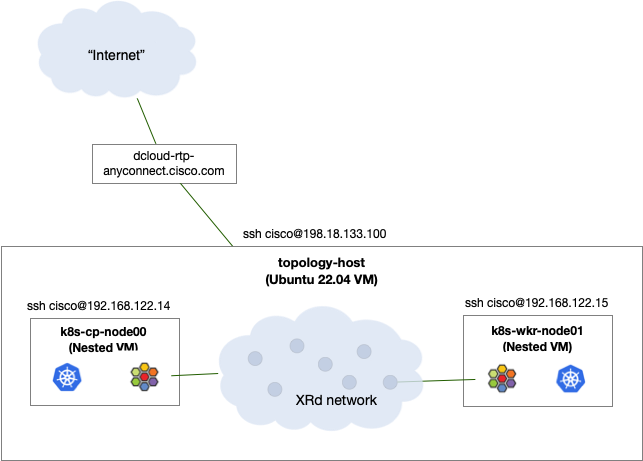
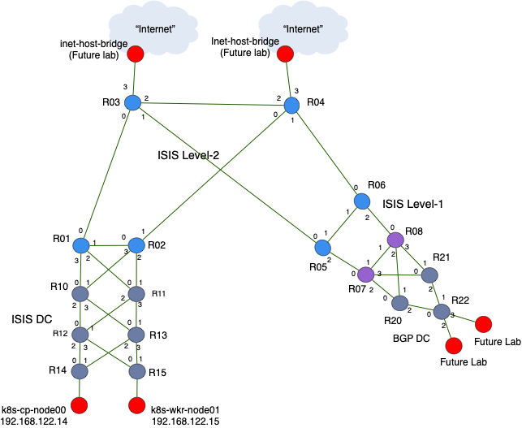
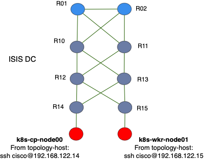

## Cloud-Native SRv6 with Cilium

Note: This lab makes use of Cilium Enterprise, which is a licensed set of features. Therefore this lab is available to Cisco internal audience only. If your customer is interested in SRv6 on Cilium or other Enterprise features please contact the relevant Isovalent sales team.

The original POC was developed in partnership with Arkadiusz Kaliwoda, Cisco SE in EMEA SP. Kali has also published demo/POC materials here: 

https://wwwin-github.cisco.com/emear-telcocloud/iblog

Many thanks Kali for your help and insight in this project!

### Contents
* Cloud-Native SRv6 with Cilium [LINK](#cloud-native-srv6-with-cilium)
* Introduction [LINK](#introduction)
* Containerlab [LINK](#containerlab)
* Ansible deploy XRd topology and K8s VMs [LINK](#ansible-deploy-xrd-topology-and-k8s-vms)
* Accessing XRd routers [LINK](#accessing-xrd-routers)
* Initialize the Cluster [LINK](#initialize-the-kubernetes-cluster)
* Install and Configure Cilium Enterprise CNI [LINK](#install-and-configure-cilium-enterprise-cni)
* Setup Cilium BGP Peering [LINK](#setup-cilium-bgp-peering)
* Cilium SRv6 Sidmanager and Locators [LINK](#cilium-srv6-sidmanager-and-locators)
* Establish Cilium VRFs [LINK](#establish-cilium-vrfs)
* Setup Cilium SRv6 Responder [LINK](#setup-cilium-srv6-responder)
* Appendix 1: Other Useful Commands [LINK](#appendix-1-other-useful-commands)
* Appendix 2: Notes, Other [LINK](#appendix-2-notes-other)

## Introduction
This lab has been published to the Cisco dCloud catalog and is accessible to all Cisco employees for hands on exposure to Cilium's SRv6 implementation. Isovalent has also published a number of labs covering a wide range of Cilium, Hubble, and Tetragon features here:

https://cilium.io/labs/

The Cilium-SRv6 dCloud Lab instance consists of a single large Ubuntu virtual machine which hosts an XRd virtual network topology and a pair of nested Ubuntu VMs where we'll initialize Kubernetes and install and configure Cilium. We will use an ansible script to launch the XRd virtual network and the two K8s VMs, that way we can get to the Cilium SRv6 work as quickly as possible.

*`Figure 1: Cilium-SRv6 dCloud Lab Setup `*



1. Once the dCloud session is running establish an Anyconnect VPN session to:
``` 
dcloud-rtp-anyconnect.cisco.com
```

  Use the username and password supplied in the dCloud UI

2. Once connected to VPN the *`topology-host`* VM is reachable via ssh as shown on the diagram above.
```
ssh cisco@198.18.133.100
```

  User/PW for all VMs and XRd instances is: *`cisco/cisco123`*

3. Once you've ssh'd into the *`topology-host`* VM cd into the cilium-srv6 directory and list the files and sub-directory structure. The majority of tasks for this lab will be run from within this directory

  ```
  cd cilium-srv6
  ls
  tree -L 3
  ```

## Containerlab
The Cilium SRv6 dCloud lab relies on the open source Containerlab tool to define and deploy our virtual network topology.
From the https://containerlab.dev/ site:

*With the growing number of containerized Network Operating Systems grows the demand to easily run them in the user-defined, versatile lab topologies.*

*Unfortunately, container orchestration tools like docker-compose are not a good fit for that purpose, as they do not allow a user to easily create connections between the containers which define a topology.*

*Containerlab provides a CLI for orchestrating and managing container-based networking labs. It starts the containers, builds a virtual wiring between them to create lab topologies of users choice and manages labs lifecycle.*

Containerlab has been pre-installed on the *`topology-host`* VM and we will use it to spin up our XRd virtual network. 

For reference the Containerlab topology definition file can be found here:  [topology](containerlab-xrd/topology.yml). 

Or you may review it from the topology-host command line: 

```
cat containerlab-xrd/topology.yml
```

The first version of the Cilium SRv6 lab has quite a few XRd routers in the topology:

*`Figure 2: Diagram of the XRd virtual network and k8s vms that we'll activate via ansible script`*



The reason we have so many routers is it gives us the ability to expand the number and types of use cases in future iterations. For the lab you're currently engaged it we'll primarily focus on the "ISIS DC" and K8s host VMs in the lower left hand portion of the network:



The *`k8s-cp-node00`* and *`k8s-wkr-node01`* VMs have Kubernetes packages loaded and will represent our K8s cluster. In this lab we'll initialize the k8s cluster, install Cilium, and then establish SRv6 L3VPN instances between our K8s nodes and the XRd network.

* Note: if you wish to reconstuct this lab in your own environment you may use these [Instructions](xtra/k8s-install.md) to install containerd and kubeadm/kubelet/kubectl on one or more hosts or VMs (bare metal, dCloud, public cloud, etc.)

## Ansible deploy XRd topology and K8s VMs
Our first step will be to run an Ansible playbook that will deploy the XRd virtual network and our Kubernetes VMs. 

1. From the *`topology-host`* cd into the cilium-srv6/ansible/ directory
```
cd ~/cilium-srv6/ansible/
```

2. Run the deploy-playbook.yml ansible script
```
ansible-playbook -i hosts deploy-playbook.yml -e "ansible_user=cisco ansible_ssh_pass=cisco123 ansible_sudo_pass=cisco123" -vv
```

  The script should complete after a couple minutes and will output status messages along the way. Once complete we expect to see output that looks something like this:

  ```
  PLAY RECAP ********************************************************************************************************************************************************
  localhost                  : ok=14   changed=12   unreachable=0    failed=0    skipped=0    rescued=0    ignored=0   
  ```

3. Next verify the deployment of XRd containers, K8s VMs, and linux bridge instances:

4. List docker/XRd containers with the *`docker ps`* command. For output we expect to see a table of running XRd containers  
```
docker ps
```

  Output should be something like:

  ```
  cisco@topology-host:~/cilium-srv6/ansible$ docker ps
  CONTAINER ID   IMAGE                             COMMAND            CREATED              STATUS              PORTS     NAMES
  b51e182c04b0   ios-xr/xrd-control-plane:7.10.2   "/usr/sbin/init"   About a minute ago   Up About a minute             clab-cilium-srv6-xrd05
  ac562e5b27bc   ios-xr/xrd-control-plane:7.10.2   "/usr/sbin/init"   About a minute ago   Up About a minute             clab-cilium-srv6-xrd13
  f045b1c5e321   ios-xr/xrd-control-plane:7.10.2   "/usr/sbin/init"   About a minute ago   Up About a minute             clab-cilium-srv6-xrd20
  6c954d2a907f   ios-xr/xrd-control-plane:7.10.2   "/usr/sbin/init"   About a minute ago   Up About a minute             clab-cilium-srv6-xrd22
  3c96989a99db   ios-xr/xrd-control-plane:7.10.2   "/usr/sbin/init"   About a minute ago   Up About a minute             clab-cilium-srv6-xrd08
  5af617e3e2e7   ios-xr/xrd-control-plane:7.10.2   "/usr/sbin/init"   About a minute ago   Up About a minute             clab-cilium-srv6-xrd11
  b3f678ced949   ios-xr/xrd-control-plane:7.10.2   "/usr/sbin/init"   About a minute ago   Up About a minute             clab-cilium-srv6-xrd12
  6399c86f5871   ios-xr/xrd-control-plane:7.10.2   "/usr/sbin/init"   About a minute ago   Up About a minute             clab-cilium-srv6-xrd01
  020ef950e2cb   ios-xr/xrd-control-plane:7.10.2   "/usr/sbin/init"   About a minute ago   Up About a minute             clab-cilium-srv6-xrd14
  f0dc3d187d4f   ios-xr/xrd-control-plane:7.10.2   "/usr/sbin/init"   About a minute ago   Up About a minute             clab-cilium-srv6-xrd06
  a46ad88a7e4c   ios-xr/xrd-control-plane:7.10.2   "/usr/sbin/init"   About a minute ago   Up About a minute             clab-cilium-srv6-xrd03
  eb9c09626b6c   ios-xr/xrd-control-plane:7.10.2   "/usr/sbin/init"   About a minute ago   Up About a minute             clab-cilium-srv6-xrd15
  6ef7def4cac6   ios-xr/xrd-control-plane:7.10.2   "/usr/sbin/init"   About a minute ago   Up About a minute             clab-cilium-srv6-xrd10
  6d9c5f0bbccc   ios-xr/xrd-control-plane:7.10.2   "/usr/sbin/init"   About a minute ago   Up About a minute             clab-cilium-srv6-xrd21
  b8e529aef8c3   ios-xr/xrd-control-plane:7.10.2   "/usr/sbin/init"   About a minute ago   Up About a minute             clab-cilium-srv6-xrd07
  6a955a47d7bf   ios-xr/xrd-control-plane:7.10.2   "/usr/sbin/init"   About a minute ago   Up About a minute             clab-cilium-srv6-xrd02
  8e02d9f1f38b   ios-xr/xrd-control-plane:7.10.2   "/usr/sbin/init"   About a minute ago   Up About a minute             clab-cilium-srv6-xrd04
  ```

5. List the KVM virtual machines that will make up our K8s cluster: 
```
virsh list --all
```

  Output should show a pair of running VMs: *`k8s-cp-node00`* and *`k8s-wkr-node01`*

6. List linux bridge instances on the topology-host VM:
```
brctl show
```

  With the *`brctl show`* command we expect to see a table of linux bridge instances, something like:

  ```
  bridge name	bridge id		STP enabled	interfaces
  br-5349196ff1f6		8000.02426ed62905	no		veth0da4256
                veth167cd28
                veth40ec7f2
                veth4e7d77e
                veth4fbd4c8
                veth901fb9e
                vetha834dac
                vethaea71ca
                vethb80748b
                vethb8e139a
                vethb95375d
                vethbdd473a
                vethccfe929
                vethce3aa25
                vethf25abaa
                vethf9c9ab6
                vethfb9a0ef
  docker0		8000.02424abc7abb	no		
  virbr0		8000.525400ae862f	yes		vnet16
                vnet18
  xrd03-host		8000.e617a21c7fbe	no		xrd03-Gi0-0-0-3
  xrd04-host		8000.5e88d5e6650f	no		xrd04-Gi0-0-0-3
  xrd14-host		8000.4e4ed37e3373	no		vnet17
                xrd14-Gi0-0-0-2
  xrd15-host		8000.8ea07664c5da	no		vnet19
                xrd15-Gi0-0-0-2
  xrd22-host		8000.32a4adf32df6	no
  ```

## Accessing XRd routers

From the *`topology-host`* VM we have two options to list the running XRd routers; we already saw the first via *`docker ps`*. The other option is to run the *containerlab inspect* CLI, which gives us a similar table, but with more info including router management IP addresses (172.20.18.x):

```
sudo containerlab inspect --all
```

1. Test ssh to an XRd router via IP or hostname, example:
```
ssh cisco@clab-cilium-srv6-xrd03
or
ssh cisco@172.20.18.103
```

2. Optional: verify ISIS and BGP connectivity are established amongst the routers in the topology. From any XRd node:
```
show isis database
show bgp ipv4 unicast summary
show bgp ipv6 unicast summary
etc.
```

## Initialize the Kubernetes cluster

1. From the topology-host VM ssh to the k8s control plane vm: *`k8s-cp-node00`* 
```
ssh cisco@k8s-cp-node00
or
ssh cisco@192.168.122.14
```

  Once connected we'll use the *`kubeadm init`* command to initialize the K8s control plane. For more info on *`kubeadm`* init please refer to https://kubernetes.io/docs/reference/setup-tools/kubeadm/kubeadm-init/

  Kubeadm init can be run without any command arguments, however, for the purposes of our lab we're going to specify k8s pod and service IP address ranges.

2. Run kubeadm init:
```
sudo kubeadm init --pod-network-cidr=10.200.0.0/16,2001:db8:200:0::/56 --service-cidr=10.96.0.0/20,2001:db8:44:44:44:44::/112
```

  A successful initialization should end with output that looks something like this:
  ```
  Your Kubernetes control-plane has initialized successfully!

  To start using your cluster, you need to run the following as a regular user:

    mkdir -p $HOME/.kube
    sudo cp -i /etc/kubernetes/admin.conf $HOME/.kube/config
    sudo chown $(id -u):$(id -g) $HOME/.kube/config

  Alternatively, if you are the root user, you can run:

    export KUBECONFIG=/etc/kubernetes/admin.conf

  You should now deploy a pod network to the cluster.
  Run "kubectl apply -f [podnetwork].yaml" with one of the options listed at:
    https://kubernetes.io/docs/concepts/cluster-administration/addons/

  Then you can join any number of worker nodes by running the following on each as root:

  kubeadm join 10.14.1.2:6443 --token kjnz1z.7t8zcd078ltya8jy \
    --discovery-token-ca-cert-hash sha256:ca00acff7b864332b6c1a5acbe7b2e960b92d0d5707985e2f66d91465ca6a404 
  ```

3. Once kubeadm init completes be sure and copy/paste these three commands on the control plane node. 
```
mkdir -p $HOME/.kube
sudo cp -i /etc/kubernetes/admin.conf $HOME/.kube/config
sudo chown $(id -u):$(id -g) $HOME/.kube/config
```

  Next we'll join the *`k8s-wkr-node01`* VM to the Kubernetes cluster

4. On the *`k8s-cp-node00`* copy the `kubeadm join` lines from the bottom of the `kubeadm init` output and paste to a separate notepad. Then type `sudo` at the beginning of the line, and delete the `\` in the middle of the command. You should now have a line that looks something like:
```
sudo kubeadm join 10.14.1.2:6443 --token 39c3m8.3c34xm1a13rp10vd --discovery-token-ca-cert-hash sha256:7fef55212ca8a46f46e803479a95c4e5df33394d7d5ee42594760a111c1808ed 
```

5. Start a new terminal session and ssh to the topology-host and then to the k8s worker vm *`k8s-wkr-node01`* and paste your modified kubeadm join into the command line to join it to the cluster
```
ssh cisco@k8s-wkr-node01
or
ssh cisco@192.168.122.15
```
  Example kubeadm join from a previous installation:

  ```
  sudo kubeadm join 10.14.1.2:6443 --token 39c3m8.3c34xm1a13rp10vd --discovery-token-ca-cert-hash sha256:7fef55212ca8a46f46e803479a95c4e5df33394d7d5ee42594760a111c1808ed  
  ```

  A successful 'join' should produce output which ends with lines like this:
  ```
  This node has joined the cluster:
  * Certificate signing request was sent to apiserver and a response was received.
  * The Kubelet was informed of the new secure connection details.

  Run 'kubectl get nodes' on the control-plane to see this node join the cluster.
```

6. Verify successfull k8s cluster initialization; from the *`k8s-cp-node00`* list the nodes in the cluster:
```
kubectl get nodes -o wide
```

  The command output should look something like:

  ```
  cisco@k8s-cp-node00:~$ kubectl get nodes -o wide
  NAME             STATUS   ROLES           AGE     VERSION   INTERNAL-IP   EXTERNAL-IP   OS-IMAGE             KERNEL-VERSION      CONTAINER-RUNTIME
  k8s-cp-node00    Ready    control-plane   2m15s   v1.30.3   10.14.1.2     <none>        Ubuntu 20.04.1 LTS   5.4.0-192-generic   containerd://1.7.19
  k8s-wkr-node01   Ready    <none>          19s     v1.30.2   10.15.1.2     <none>        Ubuntu 20.04.1 LTS   5.4.0-189-generic   containerd://1.7.19
  ```

#### Optional: 

Here are some other useful kubernetes commands at this point in the process:

  * Get k8s pod/container info for all namespaces (note, at this stage coredns pods are probably not up and ready as they depend on a future step in the process):
  ```
  kubectl get pods -A
  ```

  * Get a summary of all elements of the k8s cluster:
  ```
  kubectl get all -A
  ```
  
  * Get detailed node info:
  ```
  kubectl get node -o yaml
  ```

  * Get the K8s Internal IP for each node:
  ```
  kubectl describe nodes | grep -E 'InternalIP'
  ```

  * Get the pod CIDR allocated to each node:
  ```
  kubectl get nodes -o jsonpath='{.items[*].spec.podCIDR}'
  ```

  * Two ways of getting the CIDR range for the entire cluster
  ```
  kubectl cluster-info dump | grep -m 1 cluster-cidr
  ps -ef | grep "cluster-cidr"
  ```

## Install and Configure Cilium Enterprise CNI

We'll use a Helm chart to install Cilium Enterprise. Per the Helm homepage, *Helm helps you manage Kubernetes applications — Helm Charts help you define, install, and upgrade even the most complex Kubernetes application.*

In our lab Helm itself has been pre-installed on the dCloud nodes, however, if you wish to build this lab in your own environment Helm installation instructions can be found here: https://helm.sh/docs/intro/install/

Note: All the Cilium installation and configuration tasks will be run from *`k8s-cp-node00`*.

1. Add the Helm Cilium repository to the *`k8s control plane node`*. 
```
helm repo add isovalent https://helm.isovalent.com
```

  Expected output:
  ```
  cisco@k8s-cp-node00:~$ helm repo add isovalent https://helm.isovalent.com
  "isovalent" has been added to your repositories
  ```

2. Verify the repo with:
```
helm repo list
```

  Expected output:
  ```
  cisco@k8s-cp-node00:~$ helm repo list
  NAME     	URL                       
  isovalent	https://helm.isovalent.com
  ```

3. On the *`k8s control plane node`* cd into the cilium directory
```
cd ~/cilium-srv6/cilium/
```

4. Install Cilium Enterprise via this Helm chart: [cilium-helm-enterprise.yaml](cilium/helm-cilium-enterprise.yaml)
```
helm install cilium isovalent/cilium --version 1.15.6  --namespace kube-system -f helm-cilium-enterprise.yaml 
```
  Note: some key lines in the yaml where we specify SRv6 attributes under *enterprise*. We're also enabling Cilium BGP from the outset:

  ```
  ipv6:
    enabled: true
  enterprise:
    srv6:
      enabled: true
      encapMode: reduced
      locatorPoolEnabled: true
  bgpControlPlane:
    enabled: true
  ```

  The install command output should look something like:

  ```
  cisco@k8s-cp-node00:~/cilium-srv6/cilium$ helm install cilium isovalent/cilium --version 1.15.6  --namespace kube-system -f helm-cilium-enterprise.yaml 
  NAME: cilium
  LAST DEPLOYED: Sun Aug 18 12:06:50 2024
  NAMESPACE: kube-system
  STATUS: deployed
  REVISION: 1
  TEST SUITE: None
  NOTES:
  You have successfully installed Cilium.

  Your release version is 1.15.6.

  For any further help, visit https://docs.cilium.io/en/v1.15/gettinghelp
  ```

5. Run a couple commands to verify the Cilium Installation

  Display Cilium daemonset status:
  ```
  kubectl get ds -n kube-system cilium
  ```

  The output should show 2 cilium daemonsets (ds) available, example:
  ```
  cisco@k8s-cp-node00:~/cilium-srv6/cilium$ kubectl get ds -n kube-system cilium
  NAME     DESIRED   CURRENT   READY   UP-TO-DATE   AVAILABLE   NODE SELECTOR            AGE
  cilium   2         2         2       2            2           kubernetes.io/os=linux   62s
  ```

  Note: if the previous output shows '0' under AVAILABLE give it a couple minutes and try again. If its still showing '0' the K8s cluster may need to be reset (rare)

  Helm get values (sort of a 'show run' for the Helm/Cilium install)
  ```
  helm get values cilium -n kube-system
  ```

6. The default behavior for Kubernetes is to not run application pods or containers on the control plane node. This is loosely analogous to networks where route reflectors are usually not deployed inline and carrying transport traffic. However, we're running a small cluster in the lab and we want the ability to deploy pods on the control plane node, so in kube-speak we need to "untaint" it. To untaint the control plane node we run the "kubectl taint nodes ... " command with a "-" sign at the end:

  ```
  kubectl taint nodes --all node-role.kubernetes.io/control-plane-
  ```

  If the command output returns "taint "node-role.kubernetes.io/control-plane" not found" then the node is already untainted

##  Setup Cilium BGP Peering
First a brief explanation of *`Kubernetes Custom Resource Definitions (CRDs)`*. 

Per: https://kubernetes.io/docs/concepts/extend-kubernetes/api-extension/custom-resources/

*A custom resource is an extension of the Kubernetes API that is not necessarily available in a default Kubernetes installation. It represents a customization of a particular Kubernetes installation. However, many core Kubernetes functions are now built using custom resources, making Kubernetes more modular.*

Said another way, CRDs enable us to add, update, or delete Kubernetes cluster elements and their configurations. The add/update/delete action might apply to the cluster as a whole, a node in the cluster, an aspect of cluster networking or the CNI (aka, the work we'll do in this lab), or any given element or set of elements within the cluster including pods, services, daemonsets, etc.

A CRD applied to a single element in the K8s cluster would be analogous configuring BGP on a router. A CRD applied to multiple or cluster-wide would be analogous to adding BGP route-reflection to a network as a whole. 

CRDs come in YAML file format and in the next several sections of this lab we'll apply CRDs to the K8s cluster to setup Cilium BGP peering, establish Cilium SRv6 locator ranges, create VRFs, etc.

The initial version of this guide assumes eBGP peering between k8s nodes and *`xrd14`* & *`xrd15`*. For reference an example iBGP CRD/YAML file can be found in the cilium-srv6/cilium directory.

Here is a partial Cilium eBGP CRD (aka eBGP configuration) with notes:
```
apiVersion: "cilium.io/v2alpha1"
kind: CiliumBGPPeeringPolicy
metadata:
  name: k8s-wkr-node01
spec:
  nodeSelector:
    matchLabels:
      kubernetes.io/hostname: k8s-wkr-node01    <-------- node to which this portion of config belongs
  virtualRouters:
  - localASN: 65015                 <----- worker node's BGP ASN
    exportPodCIDR: true             <----- advertise local PodCIDR prefix
    mapSRv6VRFs: true               <----- SRv6 L3VPN
    srv6LocatorPoolSelector:        
      matchLabels:
        export: "true"              <----- advertise Locator prefix into BGP IPv6 underlay
    neighbors:
    - peerAddress: "10.15.1.1/32"   <----- ipv4 peer address for xrd15
      peerASN: 65010
      families:                     <----- address families for this BGP session
       - afi: ipv4
         safi: unicast
    - peerAddress: "2001:db8:18:15::1/128"   <----- ipv6 peer address for xrd15
      peerASN: 65010
      families:
        - afi: ipv6               <----- address families for this BGP session
          safi: unicast
        - afi: ipv4                
          safi: mpls_vpn          <----- L3VPN AFI/SAFI
```

You may review the entire Cilium eBGP policy yaml here: [Cilium BGP](cilium/ebgp-policy.yaml). Note the ebgp-policy.yaml file has BGP configuration/peering parameters for both the control plane node and worker node.

1. Apply the Cilium eBGP policy - On the k8s control plane vm cd into the cilium directory and apply the Cilium BGP CRD
```
cd ~/cilium-srv6/cilium/
kubectl apply -f ebgp-policy.yaml
```

  Note: the upstream XRd peers (xrd14 and xrd15) have already been configured per the Containerlab topology definitions, example: 

  [xrd14.cfg](containerlab-xrd/xrd-config/xrd14.cfg)

2. From the control plane node verify Cilium BGP peering with the following cilium CLI:
```
cilium bgp peers
```

  We expect to see v4 and v6 sessions active and advertisement and receipt of a number of BGP NLRIs for ipv4, ipv6, and ipv4/mpls_vpn (aka, SRv6 L3VPN). Example:
  ```
  cisco@k8s-cp-node00:~/cilium-srv6/cilium$ cilium bgp peers
  Node             Local AS   Peer AS   Peer Address        Session State   Uptime   Family          Received   Advertised
  k8s-cp-node00    65014      65010     10.14.1.1           established     2m36s    ipv4/unicast    20         1    
                  65014      65010     2001:db8:18:14::1   established     2m36s    ipv6/unicast    32         1    
                                                                                    ipv4/mpls_vpn   6          0    
  k8s-wkr-node01   65015      65010     10.15.1.1           established     2m35s    ipv4/unicast    20         1    
                  65015      65010     2001:db8:18:15::1   established     2m35s    ipv6/unicast    32         1    
                                                                                    ipv4/mpls_vpn   6          0    
  ```

## Cilium SRv6 Sidmanager and Locators
Per Cilium Enterprise documentation:
*The SID Manager manages a cluster-wide pool of SRv6 locator prefixes. You can define a prefix pool using the IsovalentSRv6LocatorPool resource. The Cilium Operator assigns a locator for each node from this prefix. In this example we'll allocate /48 bit uSID based locators.*

1. Define and apply a Cilium SRv6 locator pool, example: [srv6-locator-pool.yaml](cilium/srv6-locator-pool.yaml)

  From the ~/cilium-srv6/cilium/ directory:
  ```
  kubectl apply -f srv6-locator-pool.yaml
  ```

2. Validate locator pool
```
kubectl get sidmanager -o yaml
```
or 
```
kubectl get sidmanager -o custom-columns="NAME:.metadata.name,ALLOCATIONS:.spec.locatorAllocations"
```

  The example output below shows Cilium having allocated locator prefixes as follows:
  #### k8s-cp-node00: fc00:0:15b::/48
  #### k8s-wkr-node01: fc00:0:134::/48

  We'll want to keep track of the allocated locator prefixes as we'll need to redistribute them from BGP into ISIS later in the lab.

  Example output:
  ```
  cisco@k8s-cp-node00:~$ kubectl get sidmanager -o yaml
  apiVersion: v1
  items:
  - apiVersion: isovalent.com/v1alpha1
    kind: IsovalentSRv6SIDManager
    metadata:
      creationTimestamp: "2024-08-18T19:12:50Z"
      generation: 1
      name: k8s-cp-node00
      resourceVersion: "2593"
      uid: 4220c57d-478d-4764-92c9-d050e4a53a9a
    spec:
      locatorAllocations:
      - locators:
        - behaviorType: uSID
          prefix: fc00:0:15b::/48        <---------- Locator for the control plane node
          structure:
            argumentLenBits: 0
            functionLenBits: 16
            locatorBlockLenBits: 32
            locatorNodeLenBits: 16
        poolRef: pool0                   <---- locator pool name/id 
    status:
      sidAllocations: []  <---- no SIDs yet, we'll see SIDs allocated when we create VRFs in the next step
  - apiVersion: isovalent.com/v1alpha1
    kind: IsovalentSRv6SIDManager
    metadata:
      creationTimestamp: "2024-08-18T19:12:50Z"
      generation: 1
      name: k8s-wkr-node01
      resourceVersion: "2594"
      uid: bb01d730-2e9a-44e7-9b17-90f2df7ae553
    spec:
      locatorAllocations:
      - locators:
        - behaviorType: uSID
          prefix: fc00:0:134::/48        <---------- Locator for the worker node
          structure:
            argumentLenBits: 0
            functionLenBits: 16
            locatorBlockLenBits: 32
            locatorNodeLenBits: 16
        poolRef: pool0
    status:
      sidAllocations: []
  kind: List
  metadata:
    resourceVersion: ""

  ```

## Establish Cilium VRFs
1. Add vrf(s) - this example also adds a couple alpine linux container pods to vrf blue:
   [vrf-blue.yaml](cilium/vrf-blue.yaml)
```
kubectl apply -f vrf-blue.yaml
```

2. Verify VRF and sid allocation on the control plane node:
```
kubectl get sidmanager k8s-cp-node00 -o yaml
```

  Example output from sidmanager:
  ```
  cisco@k8s-cp-node00:~/cilium-srv6/cilium/cilium$ kubectl get sidmanager k8s-cp-node00 -o yaml
  apiVersion: isovalent.com/v1alpha1
  kind: IsovalentSRv6SIDManager
  metadata:
    creationTimestamp: "2024-08-18T19:12:50Z"
    generation: 1
    name: k8s-cp-node00
    resourceVersion: "27756"
    uid: 4220c57d-478d-4764-92c9-d050e4a53a9a
  spec:
    locatorAllocations:
    - locators:
      - behaviorType: uSID
        prefix: fc00:0:15b::/48    <------- control plane node locator
        structure:
          argumentLenBits: 0
          functionLenBits: 16
          locatorBlockLenBits: 32
          locatorNodeLenBits: 16
      poolRef: pool0
  status:
    sidAllocations:
    - poolRef: pool0
      sids:
      - behavior: uDT4      <----------- uSID L3VPN IPv4 table lookup
        behaviorType: uSID
        metadata: blue
        owner: srv6-manager
        sid:
          addr: 'fc00:0:15b:e46b::'  <---- uSID locator+function entry for control plane node VRF blue
          structure:
            argumentLenBits: 0
            functionLenBits: 16
            locatorBlockLenBits: 32
            locatorNodeLenBits: 16
  ```

3. optional: verify sidmanager status for the k8s worker node (this command should still be run on `k8s-cp-node00`):
```
kubectl get sidmanager k8s-wkr-node01 -o yaml
```

4. optional: create vrf-red:
```
kubectl apply -f vrf-red.yaml
```

5.  Run some kubectl commands to verify pod status, etc.
```
kubectl get pods -A
```

  ```
  kubectl describe pod -n blue bluepod0
  ```
  The kubectl get pods -A command should show a pair of bluepods up and running.

  Example:
  ```
  kubectl get pod -n blue bluepod0 -o=jsonpath="{.status.podIPs}"
  ```
  example output:
  ```
  [{"ip":"10.142.1.25"},{"ip":"2001:db8:142:1::f0cb"}]
  ```

6. Exec into one of the bluepod containers and ping the Cilium CNI gateway:
```
kubectl exec -it -n blue bluepod0 -- sh
ip route
ping <the "default via" address in ip route output>
```

  Output should look something like:
  ```
  cisco@k8s-cp-node00:~/cilium-srv6/cilium$ kubectl exec -it -n blue bluepod0 -- sh
  ip route/ # ip route
  default via 10.200.1.14 dev eth0 
  10.200.1.14 dev eth0 scope link 
  / # ping 10.200.1.14
  PING 10.200.1.14 (10.200.1.14): 56 data bytes
  64 bytes from 10.200.1.14: seq=0 ttl=63 time=1.378 ms
  64 bytes from 10.200.1.14: seq=1 ttl=63 time=0.142 ms
  ^C
  --- 10.200.1.14 ping statistics ---
  2 packets transmitted, 2 packets received, 0% packet loss
  round-trip min/avg/max = 0.142/0.760/1.378 ms
  ```

7. Exit the pod
```
exit
```

## Setup Cilium SRv6 Responder

1. Per the previous set of steps, once allocated SIDs appear, we need to annotate the node. This will tell Cilium to program eBPF egress policies: 
```
kubectl annotate --overwrite nodes k8s-cp-node00 cilium.io/bgp-virtual-router.65014="router-id=10.14.1.2,srv6-responder=true"
kubectl annotate --overwrite nodes k8s-wkr-node01 cilium.io/bgp-virtual-router.65015="router-id=10.15.1.2,srv6-responder=true"
```

2. Verify SRv6 Egress Policies:
```
kubectl get IsovalentSRv6EgressPolicy -o yaml
```

  Example of partial output:
  ```
  cisco@k8s-cp-node00:~/cilium-srv6/cilium$ kubectl get IsovalentSRv6EgressPolicy -o yaml
  apiVersion: v1
  items:
  - apiVersion: isovalent.com/v1alpha1
    kind: IsovalentSRv6EgressPolicy
    metadata:
      creationTimestamp: "2024-08-30T21:53:54Z"
      generation: 1
      name: bgp-control-plane-14b02862521b89dbf9af2f4b3bec460131b6c411f940a7138322db4bda004c72
      resourceVersion: "3276"
      uid: f33b55e8-798a-4ebb-9134-1b4473fc86f6
    spec:
      destinationCIDRs:
      - 10.9.0.0/24                      <---- destination prefix in VRF red (vrfID 1000009)
      destinationSID: 'fc00:1:2:e004::'  <---- prefix is reachable via flex-algo to xrd02. Cilium/eBPF will encapsulate traffic using this SID
      vrfID: 1000009

  - apiVersion: isovalent.com/v1alpha1
    kind: IsovalentSRv6EgressPolicy
    metadata:
      creationTimestamp: "2024-08-30T21:53:54Z"
      generation: 1
      name: bgp-control-plane-c0dde75d6edfc035dee7ce80bc27628c89435459e6d8681d3ebfbd5366a736f2
      resourceVersion: "3277"
      uid: badc91bf-7624-42cb-bcc1-99fa1ec187cb
    spec:
      destinationCIDRs:
      - 10.10.1.0/24                       <---- destination prefix in VRF blue (vrfID 1000012)
      destinationSID: 'fc00:0:10:e004::'   <---- prefix is reachable via xrd10. Cilium/eBPF will encapsulate using this SID
      vrfID: 1000012
  kind: List
  metadata:
    resourceVersion: ""
  ```

## Redistribute Cilium Locators into XRd ISIS
*`Figure 3 - reminder of full network topology`*


Note: Per the full network diagram above, this lab is setup where XRd nodes 10-15 are an ISIS domain within BGP ASN 65010. The K8s/Cilium nodes in this design are eBGP peers with xrd14 and xrd15 respectively. The eBGP relationship means the K8s/Cilium nodes' locators are advertised via eBGP, but ISIS midpoint nodes (xrd12 and xrd13) won't know about those routes as they're not running BGP. So for the purposes of this lab we'll redistribute the Cilium locators into ISIS. A future version of this lab will involve connecting K8s/Cilium nodes to a small RFC7938 style eBGP-only DC fabric and explore the different protocol interactions.

*`Figure 4 - reminder subset of lab topology`*


xrd14 and xrd15 have been pre-configured with prefix-sets, route-policies, and bgp-to-isis redistribution. However, due to the dynamic nature of Cilium locator allocation we need to update the prefix-sets with the new Cilium locators.

1. From the *`topology-host`* vm ssh to *`xrd14`* and *`xrd15`*, go into *`config t`* mode and update the *`cilium-locs`* prefix-set on each router. This will result in the cilium locators being advertised into the ISIS DC instance:
```
ssh cisco@clab-cilium-srv6-xrd14
ssh cisco@clab-cilium-srv6-xrd15
```

2. show the routers' prefix-set running config
```
show running-config prefix-set cilium-locs
```
Example:
```
RP/0/RP0/CPU0:xrd15#show running-config prefix-set cilium-locs
Mon Aug 19 15:25:07.379 UTC
prefix-set cilium-locs
  fc00:0:12c::/48,
  fc00:0:173::/48
end-set
```

3. update the prefix-set to use Cilium's current locators
```
conf t
```
```
prefix-set cilium-locs
 fc00:0:15b::/48,
 fc00:0:134::/48
end-set
commit
```

4. Exit xrd14 and xrd15 then ssh into upstream *`xrd12`* and verify the cilium locator prefixes appear in its ISIS routing table.
```
ssh cisco@clab-cilium-srv6-xrd12
show route ipv6
or
show isis ipv6 route
```

  Example truncated output:
  ```
  RP/0/RP0/CPU0:xrd12#show route ipv6
  Fri Aug 30 22:16:51.975 UTC

  Codes: C - connected, S - static, R - RIP, B - BGP, (>) - Diversion path
        D - EIGRP, EX - EIGRP external, O - OSPF, IA - OSPF inter area
        N1 - OSPF NSSA external type 1, N2 - OSPF NSSA external type 2
        E1 - OSPF external type 1, E2 - OSPF external type 2, E - EGP
        i - ISIS, L1 - IS-IS level-1, L2 - IS-IS level-2
        ia - IS-IS inter area, su - IS-IS summary null, * - candidate default
        U - per-user static route, o - ODR, L - local, G  - DAGR, l - LISP
        A - access/subscriber, a - Application route
        M - mobile route, r - RPL, t - Traffic Engineering, (!) - FRR Backup path

  Gateway of last resort is not set

  <snip>

  i L2 fc00:0:134::/48 
        [115/1] via fe80::a8c1:abff:fe89:3b69, 00:00:11, GigabitEthernet0/0/0/3
  i L2 fc00:0:15b::/48 
        [115/1] via fe80::a8c1:abff:feb1:78d6, 00:02:30, GigabitEthernet0/0/0/2

  ```

  Note: per the topology diagrams above *`xrd01`* and *`xrd02`* are members of the simulated Core/WAN network. The WAN is running a separate ISIS instance and BGP ASN from the small DC hosting our K8s VMs. In this network we have the ability to extend our K8s/Cilium SRv6 L3VPNs beyond the DC/WAN domain boundary to remote PE nodes in simulation of a multi-domain service provider or large Enterprise. Most of the XRd nodes already have their SRv6 L3VPN / BGP configs in place, however, the appendix section of this lab includes steps to configure a VRF and connected loopback interface on *`xrd08`* and join it to one of the Cilium L3VPN instances.

5. Verify VRF Blue is preconfigured on *`xrd10`* in the local ISIS DC domain, and *`xrd02`* which is in the external WAN domain

  Example on *`xrd10`* (these steps can be repeated on *`xrd02`* while specifying bgp 65000)
  ```
  ssh cisco@clab-cilium-srv6-xrd10

  show run interface Loopback12  
  show run router bgp 65010 vrf blue
  ```

  In the bgp vrf blue output we should see *`redistribute connected`*, which means the router is advertising its loopback12 prefix into the SRv6 L3VPN VRF.

6. ssh into the *`k8s-cp-node00`* and then exec into a bluepod container. Ping *`xrd10's`* vrf-blue interface, then ping *`xrd02's`* vrf-blue interface:
```
kubectl exec -it bluepod0 -n blue -- sh
ping 10.10.1.1 -i .3 -c 4
ping 10.12.0.1 -i .3 -c 4
```

  Expected output:
  ```
  / # ping 10.10.1.1 -i .3 -c 4
  PING 10.10.1.1 (10.10.1.1): 56 data bytes
  64 bytes from 10.10.1.1: seq=0 ttl=253 time=3.889 ms
  64 bytes from 10.10.1.1: seq=1 ttl=253 time=3.989 ms
  64 bytes from 10.10.1.1: seq=2 ttl=253 time=3.792 ms
  64 bytes from 10.10.1.1: seq=3 ttl=253 time=3.767 ms

  --- 10.10.1.1 ping statistics ---
  4 packets transmitted, 4 packets received, 0% packet loss
  round-trip min/avg/max = 3.767/3.859/3.989 ms
  / # ping 10.12.0.1 -i .3 -c 4
  PING 10.12.0.1 (10.12.0.1): 56 data bytes
  64 bytes from 10.12.0.1: seq=0 ttl=253 time=5.140 ms
  64 bytes from 10.12.0.1: seq=1 ttl=253 time=5.897 ms
  64 bytes from 10.12.0.1: seq=2 ttl=253 time=5.556 ms
  64 bytes from 10.12.0.1: seq=3 ttl=253 time=5.342 ms

  --- 10.12.0.1 ping statistics ---
  4 packets transmitted, 4 packets received, 0% packet loss
  round-trip min/avg/max = 5.140/5.483/5.897 ms
  / # 
  ```

### You have completed the Cilium-SRv6 lab, huzzah!

## Appendix 1: other Useful Commands
The following commands can all be run from the k8s-cp-node00:

1. Self explanatory Cilium BGP commands:
```
cilium bgp routes advertised ipv4 mpls_vpn 
cilium bgp routes available ipv4 mpls_vpn
cilium bgp routes available ipv4 unicast
cilium bgp routes available ipv6 unicast
```

2. Isovalent/Cilium/eBPF commands:

  Get VRF info:
  ```
  kubectl get isovalentvrf -o yaml
  ```

  Get SRv6 Egress Policy info (SRv6 L3VPN routing table):
  ```
  kubectl get IsovalentSRv6EgressPolicy
  kubectl get IsovalentSRv6EgressPolicy -o yaml
  ```
  Get detail on a specific entry:
  ```
  kubectl get IsovalentSRv6EgressPolicy bgp-control-plane-16bbd4214d4e691ddf412a6a078265de02d8cff5a3c4aa618712e8a1444477a9 -o yaml
  ```

  Get Cilium eBPF info for SID, VRF, and SRv6 Policy - note: first run kubectl get pods to get the cilium agent pod names:
  ```
  cisco@k8s-cp-node00:~$ kubectl get pods -n kube-system
  NAME                                    READY   STATUS    RESTARTS      AGE
  cilium-97pz8                            1/1     Running   0             20m
  cilium-kxdcd                            1/1     Running   0             20m
  ```

  Then run cilium-dbg ebpf commands:
  The first command outputs the nodes' local SID table
  The second command outputs the nodes' local VRF table
  The third command outputs a summary of the nodes' srv6 l3vpn routing table
  ```
  kubectl exec -n kube-system cilium-97pz8 -- cilium-dbg bpf srv6 sid
  kubectl exec -n kube-system cilium-97pz8 -- cilium-dbg bpf srv6 vrf
  kubectl exec -n kube-system cilium-97pz8 -- cilium-dbg bpf srv6 policy
  ```

  Example output:
  ```
  cisco@k8s-cp-node00:~$ kubectl exec -n kube-system cilium-97pz8 -- cilium-dbg bpf srv6 sid
  Defaulted container "cilium-agent" out of: cilium-agent, config (init), mount-cgroup (init), apply-sysctl-overwrites (init), mount-bpf-fs (init), wait-for-node-init (init), clean-cilium-state (init), install-cni-binaries (init)
  SID                VRF ID
  fc00:0:12d:2f3::   1000012
  cisco@k8s-cp-node00:~$ kubectl exec -n kube-system cilium-kxdcd -- cilium-dbg bpf srv6 sid
  Defaulted container "cilium-agent" out of: cilium-agent, config (init), mount-cgroup (init), apply-sysctl-overwrites (init), mount-bpf-fs (init), wait-for-node-init (init), clean-cilium-state (init), install-cni-binaries (init)
  SID                 VRF ID
  fc00:0:12c:8d1d::   1000012
  cisco@k8s-cp-node00:~$ 
  ```

  Get Cilium global config:
  ```
  kubectl get configmap -n kube-system cilium-config -o yaml
  ```

## Appendix 2: Notes, Other

1.  helm uninstall
```
helm uninstall cilium -n kube-system
```

2.  helm list
```
cisco@k8s-cp-node00:~/cilium$ helm list -n kube-system
NAME  	NAMESPACE  	REVISION	UPDATED                              	STATUS  	CHART        	APP VERSION
cilium	kube-system	1       	2024-08-13 21:30:50.1523314 -0700 PDT	deployed	cilium-1.15.6	1.15.6    
```

#### Changing the locator pool
May cause Cilium's eBPF SRv6 programming to fail (the features are currently beta)

```
cisco@k8s-cp-node00:~/cilium$ kubectl apply -f loc-pool-test.yaml 
isovalentsrv6locatorpool.isovalent.com/pool0 created
cisco@k8s-cp-node00:~/cilium$ kubectl get IsovalentSRv6EgressPolicy -o yaml
apiVersion: v1
items: []
kind: List
metadata:
  resourceVersion: ""
```
The workaround appears to be uninstall then reinstall Cilium

### eBGP host-to-ToR
If locatorLenBits: 48 then
1. On ToR create static route to host locator /48, redistribute into ISIS

If locatorLenBits: 64 then:

2. set functionLenBits to 32
   
3. on ToR create static route to host locator /64 and static route to locator /128, redistribute into ISIS
Example:
```
router static
 address-family ipv6 unicast
  fc00:0:4000::/128 2001:db8:18:44:5054:60ff:fe01:a008
  fc00:0:4000:2b::/64 2001:db8:18:44:5054:60ff:fe01:a008
```

Note: if the ToR/DC domain has an eBGP relationship with other outside domains (WAN, etc.) BGP IPv6 unicast will advertise the /64 locator networks out, but the /128 won't appear in DC BGP without some other redistribution (static /128 into DC BGP?). 

## Appendix 3: configure VRF blue on xrd08
Note: as of August 30, 2024 this section is under construction

1. From *`topology-host`* ssh to *`xrd08`*
```
ssh cisco@clab-cilium-srv6-xrd08
```

2. Go into *`conf t`* mode and apply VRF config:
  ```
  conf t

  vrf blue
  address-family ipv4 unicast
    import route-target
    12:12
    !
    export route-target
    12:12
    !
  !
  address-family ipv6 unicast
    import route-target
    12:12
    !
    export route-target
    12:12
    !
  !
  !
  interface Loopback12
  vrf blue
  ipv4 address 10.12.8.1 255.255.255.0
  !
  router bgp 65000
  vrf blue
    rd auto
    address-family ipv4 unicast
    segment-routing srv6
      alloc mode per-vrf
    !
    redistribute connected

  commit
  ```